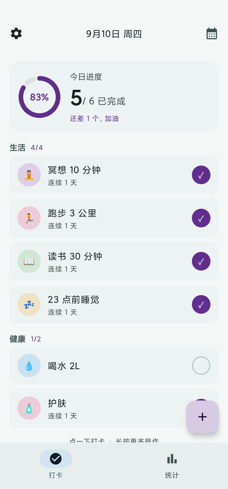
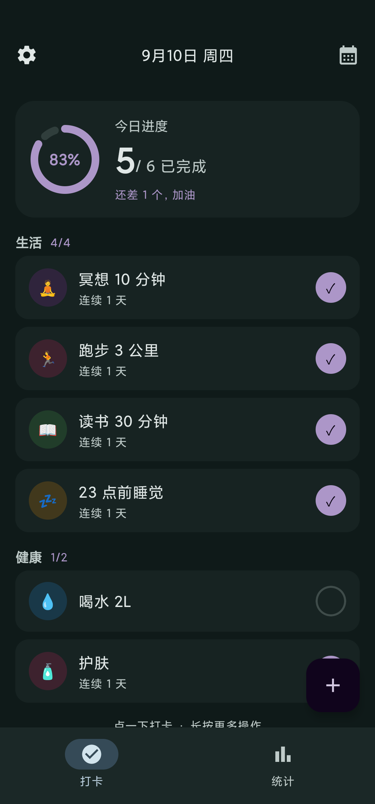
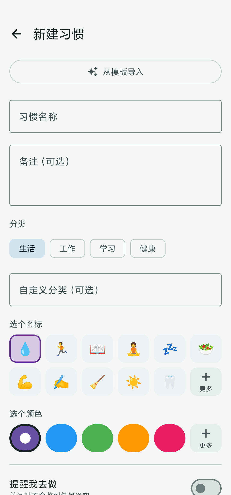
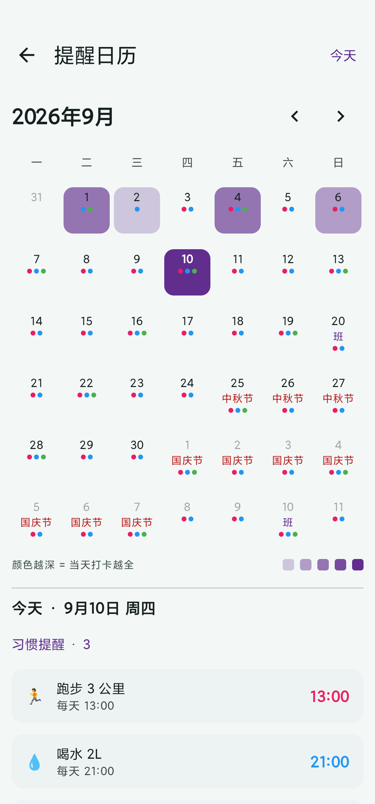
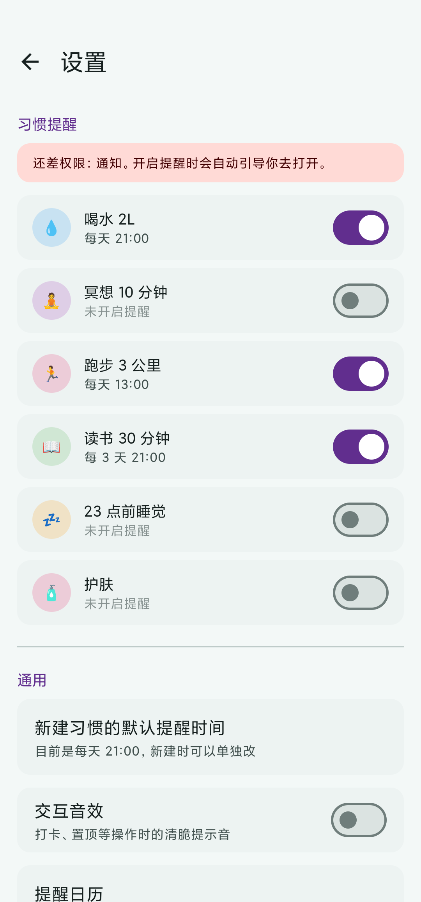
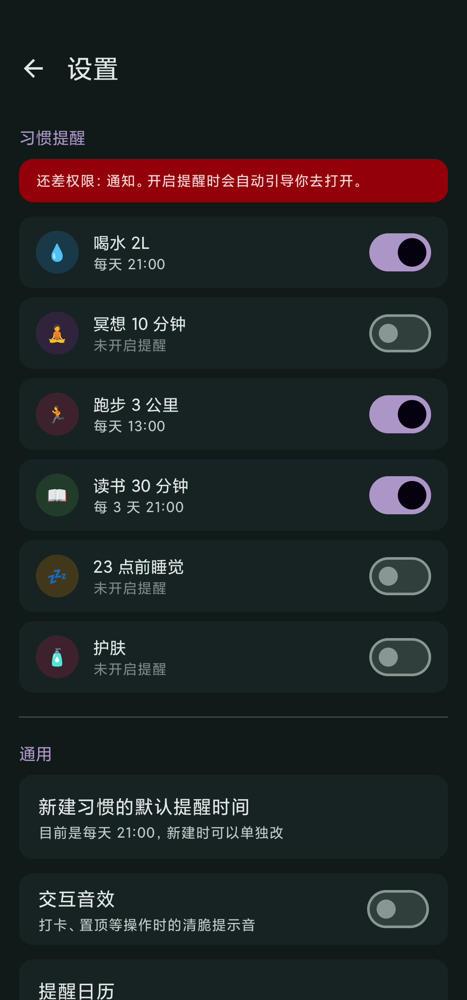

# DAKA · 习惯打卡

<p align="center">
  
  
  
  
  
</p>

一个**纯本地、无后端、无账号**的 Android 习惯打卡应用，用 Jetpack Compose 从零构建。

> 🔒 **本地优先（Local-first）**：所有数据只存在你手机本机的 Room 数据库里，App **不申请任何网络权限**，不上传、不登录、不追踪。备份靠导出 JSON 文件，数据完全由你掌控。

---

## 📱 简介

DAKA 是一个自用优先、现在开源的习惯打卡工具。它不联网、不上云，目标就是把"今天该做哪几件事、连续做了几天"这件事做得简单又顺手：

- 在桌面小组件上**直接勾选**今日习惯，和 Google Keep 清单一样所见即所点；
- 分类随你建，想加"运动""读书""副业"随手就建，零迁移；
- 中国法定工作日 / 节假日内置，提醒不会在休息日乱响；
- 数据导出一个 JSON 就能备份、换机、分享。

---

## ✨ 功能特性

| 能力 | 说明 |
| --- | --- |
| **习惯打卡** | 今日完成度、连续打卡天数（streak）、历史打卡记录 |
| **分类管理** | 内置 `生活 / 工作 / 学习 / 健康`，且**可自定义任意分类**（提交即建，零迁移） |
| **拖拽排序** | 长按拖动调整顺序、跨分类移动、置顶，带弹簧让位动画，跟手不卡顿 |
| **每习惯独立提醒** | 每天 / 每 N 天 / 每周某几天 / 每月某几号 / 工作日 / 周末；结束条件（永不 / N 次 / 到日期） |
| **日历视图** | 月视图 + 当日提醒清单 + **系统日历双向同步** |
| **中国法定节假日** | 工作日判断内置 2026 官方安排（含调休），表外年份退化为普通周末判断 |
| **数据备份 / 恢复** | 导出 JSON（可分享），恢复前先预览再导入 |
| **桌面小组件** | `2×2` / `4×3` / `1×4` 三种，参考 Google Keep 清单范式，桌面上直接勾选、实时同步；设置页可引导关闭电池优化，减少 MIUI 等 ROM 延迟刷新 |
| **交互音效** | 清脆可关 |
| **多语言（i18n）** | 中文 / English 可切换（设置 → 语言），也跟随系统 |
| **主题** | 跟随系统 / 浅色 / 深色三选一（设置 → 主题），清新薄荷青绿配色底座，所有界面卡片重绘不闪屏 |
| **新手引导** | 首次启动四步引导，最后一步可选「不再显示」 |
| **统计页** | 连续天数、完成率、日历热力图等，原生 Canvas 绘制，无第三方图表库 |
| **检查更新** | 设置页显示当前 / 最新版本号，有新版红点提醒，1 小时缓存，不弹窗，自行决定是否更新 |
| **桌面快捷方式** | 长按图标：新建习惯 / 查看统计 / 一键打卡（批量补打今天所有未打卡活跃习惯） |
| **习惯备注** | 每个习惯可填备注（任意文本），随习惯存库；新建页草稿停手 400ms 自动保存，返回再进不丢 |
| **自适应图标** | 清新的绿色渐变圆角方 + 白色对勾 |

---

## 📸 截图

K40 真机截图（已裁掉顶部通知栏），共 6 张覆盖四个核心页面的浅/深主题：

| 首页（浅色） | 首页（深色） |
| --- | --- |
|  |  |

| 新建习惯 | 提醒日历 |
| --- | --- |
|  |  |

| 设置（浅色） | 设置（深色） |
| --- | --- |
|  |  |

> 每张习惯卡片底部都自带一行小字提示「◀ 左滑编辑 · 右滑置顶 ▶」，
> 配合首页底部的「左滑编辑 · 右滑置顶 · 长按拖动排序」，滑动手势不用猜就知道。
> 主题切换在「设置 → 主题」里，跟随系统 / 浅色 / 深色三选一，立即生效不闪屏。

---

## 🛠 技术栈

| 类别 | 选型 |
| --- | --- |
| 语言 | Kotlin 2.2.10 |
| UI | Jetpack Compose (Material3) |
| 构建 | Android Gradle Plugin 9.3 / Gradle 9.5 |
| 最低 / 目标 / 编译 | minSdk 26 / targetSdk 37 / compileSdk 37 |
| 本地数据库 | Room 2.8（KSP 生成代码） |
| 键值存储 | DataStore (Preferences) |
| 桌面组件 | Glance (AppWidget) |
| 导航 | Navigation Compose |
| JSON | kotlinx.serialization |

**架构**：UI（Compose）← ViewModel（StateFlow）← 数据层（Room DAO / Repository）。
数据库变更一律走 Room Migration，绝不丢老用户数据。

> 当前数据库版本 **v5**（`habits` 表含 `note` 列），迁移脚本集中在 `HabitDatabase.kt`。

---

## 📦 构建与运行

**前置条件**

- Android SDK（compileSdk 37）
- JDK 17
- 一台 Android 8.0+ 设备（或模拟器）

```bash
./gradlew assembleDebug      # 调试包，可直接 adb install
./gradlew assembleRelease   # 发布包（需配置签名，见下）
```

> 默认 `settings.gradle.kts` 使用阿里云 Maven 镜像加速国内依赖下载；
> 如需纯官方源，把镜像块注释掉即可（会自动回落官方源，不会"某个依赖突然拉不到"）。

安装到已连接的设备：

```bash
adb install -r app/build/outputs/apk/debug/app-debug.apk
```

---

## 🔏 发布签名

`release` 构建默认不签名。生成你自己的密钥库后，在 **`local.properties`**
（已被 `.gitignore` 忽略，**绝不提交**）追加：

```properties
RELEASE_STORE_FILE=../daka-release.keystore
RELEASE_STORE_PASSWORD=你的密钥库密码
RELEASE_KEY_ALIAS=daka
RELEASE_KEY_PASSWORD=你的密钥密码
```

生成密钥库：

```bash
keytool -genkeypair -v -keystore daka-release.keystore \
  -alias daka -keyalg RSA -keysize 2048 -validity 10000
```

`app/build.gradle.kts` 会在 `local.properties` 存在上述字段时自动启用 release 签名。

---

## 💾 数据备份与恢复

设置页 → **备份**（导出 JSON 到共享存储，可分享给网盘 / 微信）；
恢复时先预览（习惯数 / 记录数 / 导出日期）再导入。

> ⚠️ 数据库位于应用私有目录，**卸载 App 会清除数据，请先备份**。

---

## 🚀 桌面快捷方式

长按桌面上的 DAKA 图标，弹出三个快捷操作（静态快捷方式，无需进 App）：

| 快捷方式 | 行为 |
| --- | --- |
| **新建习惯** | 直接打开应用内「新建习惯」页 |
| **查看统计** | 直接打开「统计」页 |
| **一键打卡** | 一次性补打**今天所有还没打卡的活跃习惯**（已打卡的不重复打） |

> 一键打卡适合"睡前一键补完今天漏掉的"场景；若今天已全部打完，则提示"今天没有待打卡的习惯"。
> 显示前提是桌面启动器支持静态快捷方式（MIUI / 原生启动器 / 多数第三方启动器均支持）。

新建习惯页里的**备注输入框**为可选：随便写什么都行，返回时（停手 400ms）自动存草稿，
下次再进自动恢复，不会因误返回而清空。保存后备注随习惯一起存库，编辑页也能改。

---

## 🗂 自定义分类

新建 / 编辑习惯时，分类区提供内置 chip + 一个「**自定义分类（可选）**」输入框；
输入任意名称并保存，即自动创建该分类，首页自动把它当成一个新分组显示。

分类本质是 `Habit.category` 字符串字段，没有独立分类表，因此自建零成本。

---

## 🧱 项目结构（简）

```
app/src/main/java/com/marvin/daka/
├── model/          # 数据模型（Habit / 打卡记录 / 分类）
├── data/           # Room 数据库、DAO、Repository、Migration
├── ui/
│   ├── home/       # 首页（分组列表、拖拽排序、ViewModel）
│   ├── create/     # 新建 / 编辑习惯（含自定义分类输入框）
│   ├── calendar/   # 日历视图 + 系统日历同步
│   └── settings/   # 设置、备份 / 恢复
└── widget/         # 桌面小组件（Glance：2×2 / 4×3 / 1×4）
```

---

## 🗺 Roadmap

- [ ] 桌面小组件支持编辑 / 删除习惯
- [x] 周 / 月打卡统计图表（统计页，原生 Canvas 绘制）
- [ ] 习惯模板库（一键导入常用习惯）
- [x] 桌面快捷方式（新建 / 统计 / 一键打卡）+ 习惯备注草稿
- [x] 多语言（i18n）
- [x] 主题切换（跟随系统 / 浅色 / 深色）
- [x] 每张卡片加侧滑操作提示
- [ ] 自动化测试补齐

---

## 📜 版本

### v1.3.4（2026-09-03）— 小组件实时刷新修复

- **修复小组件「不实时」**：`refreshHabitWidgets` 改为模块级非取消协程作用域，用户切走/杀后台后刷新广播仍会发出，不再依赖调用方 `ViewModelScope`。
- **MIUI 电池优化豁免入口**：设置页新增「电池优化」项，显示当前是否已豁免；未豁免时一键跳系统对话框，把 DAKA 加入白名单，避免 MIUI / 国产 ROM 杀后台导致小组件刷新延迟几秒。
- 升级 `versionName 1.3.4`、`versionCode 12`。

### v1.3.3（2026-09-03）— 桌面快捷方式 + 备注草稿

- **桌面长按图标快捷方式（3 条）**：新建习惯（跳应用内新建页）、查看统计（跳统计页）、一键打卡（批量补打今天所有未打卡活跃习惯）。
- **习惯备注**：新建 / 编辑习惯支持填备注（任意文本），随习惯存库。
- **备注草稿自动保存**：新建页停手 400ms 自动落盘（DataStore），返回再进自动恢复，不丢失。
- **图标选择精简**：图标推荐 3 行 → 2 行、颜色推荐 2 行 → 1 行，一屏多看更好选。
- **代码精简（功能不变）**：抽取 `Habit.withReminder()` 统一三处提醒字段映射；`HabitRecordDao` 新增 `exists()`，提醒接收器与桌面小组件切换打卡免全表加载；数据库升至 v5（`habits.note` 列，含 v4→v5 迁移，旧数据保留）。
- 真机（Redmi K40）复验：一键打卡正确补打缺失记录，无崩溃；Release APK v2 签名验证通过。

### v1.3.2（2026-09-01）— 检查更新

- 设置页新增「检查更新」：显示当前 / 最新版本号，有新版红点提醒，1 小时缓存，不弹窗，用户自行决定是否更新。
- 文案区分「当前已是最新版本」与真实失败提示。

### v1.2.0（2026-09-01）— 主题 + 卡片提示

- 配色底座换成清新薄荷青绿，去掉 Material You 动态取色，避免与 40 色习惯色板打架；
  桌面小组件同步统一到同一族墨绿/青绿（之前是紫灰暗色调）。
- **设置 → 主题**：跟随系统 / 浅色 / 深色三选一，Compose 换 colorScheme 即时重绘，不重建 Activity、不闪屏。
- **每张习惯卡片底部加一行侧滑操作提示**「◀ 左滑编辑 · 右滑置顶 ▶」，
  极淡 labelSmall 50% 透明，不抢打卡状态/7 天格子的视觉焦点；
  首页底部那条全局提示保留，给长按拖动一起讲清楚。
- 桌面小组件和设置页加了对应的深色截图（README 截图区从 4 张扩到 6 张）。

### v1.1.0（2026-09-01）— 多语言 + 新手引导

- 全量字符串外置（中文/English），设置页可切换；日期/星期按应用语言本地化。
- 首启动 4 步引导，末步可勾「不再显示」。
- 桌面小组件从 1×1 / 4×3 双尺寸扩到 2×2 / 4×3 / 1×4 三尺寸（Keep 清单风格）。
- 保留左右滑提示，操作面板悬浮化；修复组件"点了不刷新"（用 DAO 直查替代 Flow 缓存）。

### v1.0.0（2026-09-01）— 首个稳定版

- 习惯打卡、分类管理、拖拽排序、每习惯独立提醒、日历视图（系统日历双向同步）、
  法定节假日、JSON 备份/恢复、清脆音效、Keep 风格桌面小组件（2×2）。

欢迎在 Issue 里提建议或认领。

---

## 🤝 贡献

欢迎 Issue / PR。见 [CONTRIBUTING.md](CONTRIBUTING.md)。
请保持"纯本地、无后端"的产品定位——本仓库不接受引入网络同步 / 账号体系的改动。

---

## 📄 许可证

[MIT](LICENSE) © 2026 Marvin

---

## 👤 作者

Marvin · 个人习惯打卡工具，自用起步，开源共享。
