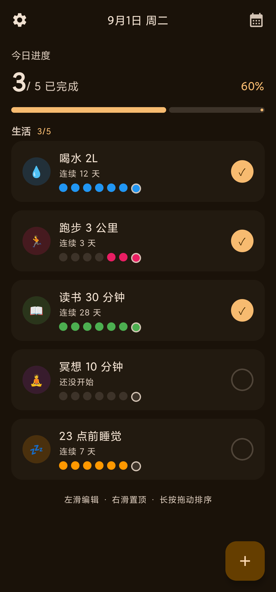
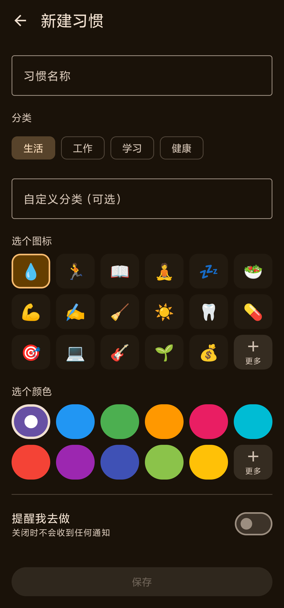
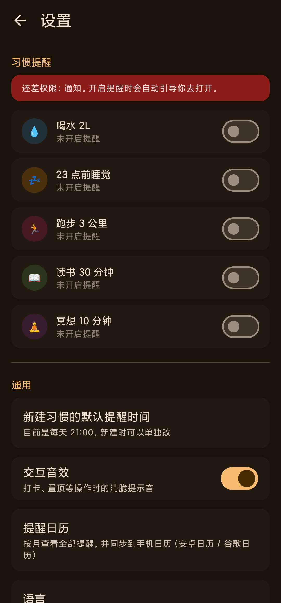
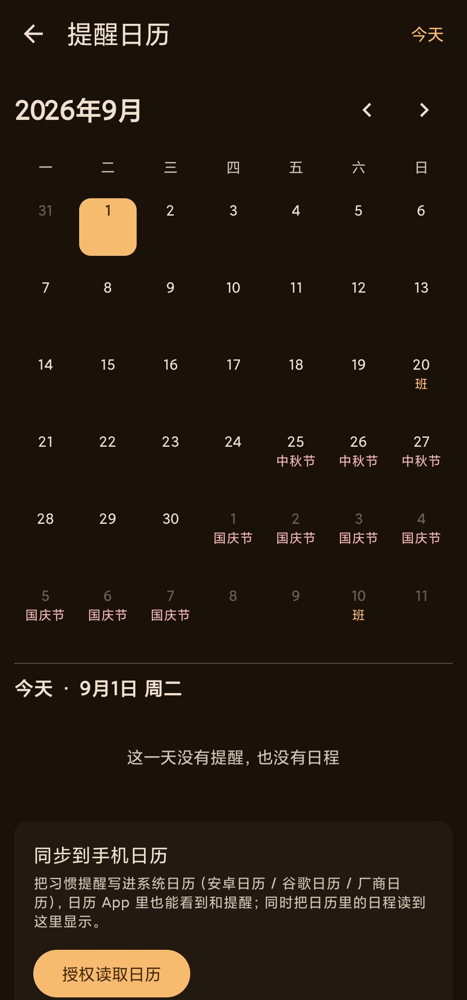

# DAKA · 习惯打卡

<p align="center">
  
  
  
  
  
</p>

一个**纯本地、无后端、无账号**的 Android 习惯打卡应用，用 Jetpack Compose 从零构建。

> 🔒 **本地优先（Local-first）**：所有数据只存在你手机本机的 Room 数据库里，App **不申请任何网络权限**，不上传、不登录、不追踪。备份靠导出 JSON 文件，数据完全由你掌控。

---

## 📱 简介

DAKA 是一个自用优先、现在开源的习惯打卡工具。它不联网、不上云，目标就是把"今天该做哪几件事、连续做了几天"这件事做得简单又顺手：

- 在桌面小组件上**直接勾选**今日习惯，和 Google Keep 清单一样所见即所点；
- 分类随你建，想加"运动""读书""副业"随手就建，零迁移；
- 中国法定工作日 / 节假日内置，提醒不会在休息日乱响；
- 数据导出一个 JSON 就能备份、换机、分享。

---

## ✨ 功能特性

| 能力 | 说明 |
| --- | --- |
| **习惯打卡** | 今日完成度、连续打卡天数（streak）、历史打卡记录 |
| **分类管理** | 内置 `生活 / 工作 / 学习 / 健康`，且**可自定义任意分类**（提交即建，零迁移） |
| **拖拽排序** | 长按拖动调整顺序、跨分类移动、置顶，带弹簧让位动画，跟手不卡顿 |
| **每习惯独立提醒** | 每天 / 每 N 天 / 每周某几天 / 每月某几号 / 工作日 / 周末；结束条件（永不 / N 次 / 到日期） |
| **日历视图** | 月视图 + 当日提醒清单 + **系统日历双向同步** |
| **中国法定节假日** | 工作日判断内置 2026 官方安排（含调休），表外年份退化为普通周末判断 |
| **数据备份 / 恢复** | 导出 JSON（可分享），恢复前先预览再导入 |
| **桌面小组件** | `2×2` / `4×3` / `1×4` 三种，参考 Google Keep 清单范式，桌面上直接勾选、实时同步 |
| **交互音效** | 清脆可关 |
| **多语言（i18n）** | 中文 / English 可切换（设置 → 语言），也跟随系统 |
| **新手引导** | 首次启动四步引导，最后一步可选「不再显示」 |
| **自适应图标** | 清新的绿色渐变圆角方 + 白色对勾 |

---

## 📸 截图

K40 真机截图（已裁掉顶部通知栏）：

| 首页 | 新建习惯 |
| --- | --- |
|  |  |

| 设置 | 提醒日历 |
| --- | --- |
|  |  |

> 首页底部「**左滑编辑 · 右滑置顶 · 长按拖动排序**」提示：左滑卡片进编辑，右滑卡片切换置顶，长按拖动改变顺序。

---

## 🛠 技术栈

| 类别 | 选型 |
| --- | --- |
| 语言 | Kotlin 2.2.10 |
| UI | Jetpack Compose (Material3) |
| 构建 | Android Gradle Plugin 9.3 / Gradle 9.5 |
| 最低 / 目标 / 编译 | minSdk 26 / targetSdk 37 / compileSdk 37 |
| 本地数据库 | Room 2.8（KSP 生成代码） |
| 键值存储 | DataStore (Preferences) |
| 桌面组件 | Glance (AppWidget) |
| 导航 | Navigation Compose |
| JSON | kotlinx.serialization |

**架构**：UI（Compose）← ViewModel（StateFlow）← 数据层（Room DAO / Repository）。
数据库变更一律走 Room Migration，绝不丢老用户数据。

---

## 📦 构建与运行

**前置条件**

- Android SDK（compileSdk 37）
- JDK 17
- 一台 Android 8.0+ 设备（或模拟器）

```bash
./gradlew assembleDebug      # 调试包，可直接 adb install
./gradlew assembleRelease   # 发布包（需配置签名，见下）
```

> 默认 `settings.gradle.kts` 使用阿里云 Maven 镜像加速国内依赖下载；
> 如需纯官方源，把镜像块注释掉即可（会自动回落官方源，不会"某个依赖突然拉不到"）。

安装到已连接的设备：

```bash
adb install -r app/build/outputs/apk/debug/app-debug.apk
```

---

## 🔏 发布签名

`release` 构建默认不签名。生成你自己的密钥库后，在 **`local.properties`**
（已被 `.gitignore` 忽略，**绝不提交**）追加：

```properties
RELEASE_STORE_FILE=../daka-release.keystore
RELEASE_STORE_PASSWORD=你的密钥库密码
RELEASE_KEY_ALIAS=daka
RELEASE_KEY_PASSWORD=你的密钥密码
```

生成密钥库：

```bash
keytool -genkeypair -v -keystore daka-release.keystore \
  -alias daka -keyalg RSA -keysize 2048 -validity 10000
```

`app/build.gradle.kts` 会在 `local.properties` 存在上述字段时自动启用 release 签名。

---

## 💾 数据备份与恢复

设置页 → **备份**（导出 JSON 到共享存储，可分享给网盘 / 微信）；
恢复时先预览（习惯数 / 记录数 / 导出日期）再导入。

> ⚠️ 数据库位于应用私有目录，**卸载 App 会清除数据，请先备份**。

---

## 🗂 自定义分类

新建 / 编辑习惯时，分类区提供内置 chip + 一个「**自定义分类（可选）**」输入框；
输入任意名称并保存，即自动创建该分类，首页自动把它当成一个新分组显示。

分类本质是 `Habit.category` 字符串字段，没有独立分类表，因此自建零成本。

---

## 🧱 项目结构（简）

```
app/src/main/java/com/marvin/daka/
├── model/          # 数据模型（Habit / 打卡记录 / 分类）
├── data/           # Room 数据库、DAO、Repository、Migration
├── ui/
│   ├── home/       # 首页（分组列表、拖拽排序、ViewModel）
│   ├── create/     # 新建 / 编辑习惯（含自定义分类输入框）
│   ├── calendar/   # 日历视图 + 系统日历同步
│   └── settings/   # 设置、备份 / 恢复
└── widget/         # 桌面小组件（Glance：2×2 / 4×3 / 1×4）
```

---

## 🗺 Roadmap

- [ ] 桌面小组件支持编辑 / 删除习惯
- [ ] 周 / 月打卡统计图表
- [ ] 习惯模板库（一键导入常用习惯）
- [x] 多语言（i18n）
- [ ] 自动化测试补齐

欢迎在 Issue 里提建议或认领。

---

## 🤝 贡献

欢迎 Issue / PR。见 [CONTRIBUTING.md](CONTRIBUTING.md)。
请保持"纯本地、无后端"的产品定位——本仓库不接受引入网络同步 / 账号体系的改动。

---

## 📄 许可证

[MIT](LICENSE) © 2026 Marvin

---

## 👤 作者

Marvin · 个人习惯打卡工具，自用起步，开源共享。
